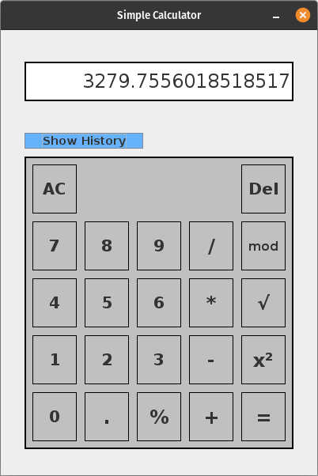
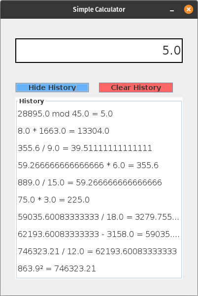
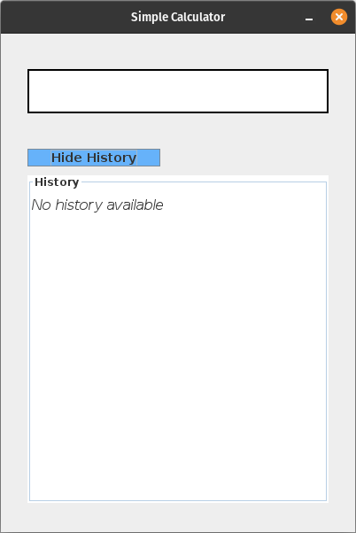

# Simple Calculator App (Java Swing)

A basic calculator application built using **Java Swing**. It supports standard arithmetic operations along with additional features like square, square root, percentage, modulus, and a calculation history panel.

---

## 📸 Screenshots






---

## 🛠️ Features

- Basic arithmetic: `+`, `-`, `*`, `/`
- Advanced operations:
  - Percentage (`%`)
  - Square (`x²`)
  - Square root (`√`)
  - Modulus (`mod`)
- Decimal input (`.`)
- All Clear (`AC`) and Delete (`Del`)
- History tracking (shows last 10 calculations)
- Show/Hide history panel
- Clear history option
- Responsive UI with `GridLayout`

---


### How to Run

1. Clone the repository
2. Compile and run:

```bash
javac CalculatorApp.java
java CalculatorApp
